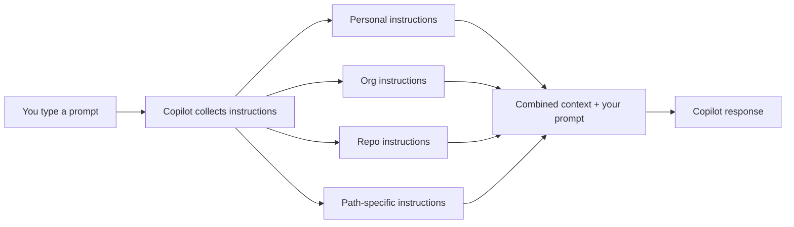

import ConfigBuilder from '@site/src/components/copilot/ConfigBuilder';
import FileTree from '@site/src/components/copilot/FileTree';
import Quiz from '@site/src/components/copilot/Quiz';

# Custom Instructions

Custom Instructions are **always-on context** — they're automatically included in every Copilot interaction. No invocation needed. Think of them as your team's coding standards, baked directly into the AI.

## How It Works



## Instruction Levels

### 1. Repository-Wide Instructions

A single file that applies to the entire repo:

```markdown title=".github/copilot-instructions.md"
# Project Conventions

- Use TypeScript with strict mode enabled
- All components must be functional (no class components)
- Use `pnpm` for package management
- Follow the Conventional Commits specification
- All public APIs must have JSDoc comments
- Prefer `const` assertions over `as const` type annotations
```

### 2. Path-Specific Instructions

Target instructions to specific file types or directories using `applyTo` glob patterns:

```markdown title=".github/instructions/react.instructions.md"
---
applyTo: "src/components/**/*.tsx"
---

- Use React Server Components by default
- Client components must have `'use client'` directive
- Props interfaces should be named `{ComponentName}Props`
- Colocate styles using CSS Modules (`.module.css`)
- Every component must export a default function
```

```markdown title=".github/instructions/api.instructions.md"
---
applyTo: "src/api/**/*.ts"
---

- All endpoints must validate input with Zod schemas
- Return proper HTTP status codes (don't always 200)
- Include request ID in error responses
- Log all errors with structured JSON logging
- Rate limiting is handled by middleware — don't add it per-route
```

### 3. Personal Instructions

Set via **GitHub Settings → Copilot → Custom instructions** in the UI. These follow you across all repos and aren't committed to any repository.

Good for personal preferences:
- "I prefer arrow functions over function declarations"
- "Always suggest the most accessible HTML element"
- "I use Vim keybindings — don't suggest mouse-based workflows"

### 4. Organization Instructions

Admins configure these in **Org Settings → Copilot → Custom instructions**. They apply to every member using Copilot within the org.

Good for:
- Company-wide security policies
- Compliance requirements
- Shared framework conventions

## File Structure

<FileTree
  files={[
    { name: '.github', type: 'dir', children: [
      { name: 'copilot-instructions.md', type: 'file' },
      { name: 'instructions', type: 'dir', children: [
        { name: 'react.instructions.md', type: 'file' },
        { name: 'api.instructions.md', type: 'file' },
        { name: 'tests.instructions.md', type: 'file' },
        { name: 'docs.instructions.md', type: 'file' },
      ]},
    ]},
  ]}
  highlight={['copilot-instructions.md']}
/>

## Real-World Example: Accessibility Standards

```markdown title=".github/instructions/accessibility.instructions.md"
---
applyTo: "src/**/*.tsx"
---

# Accessibility Requirements

All UI components MUST meet WCAG 2.1 AA standards:

- Every `` needs meaningful `alt` text (not "image" or "photo")
- Interactive elements must be keyboard-navigable
- Use semantic HTML: `<button>` not `<div onClick>`
- Color contrast ratio must be at least 4.5:1 for text
- Form inputs must have associated `<label>` elements
- Use `aria-live` regions for dynamic content updates
- Never use `tabindex` greater than 0
```

## Try It: Build Your Own

<ConfigBuilder type="instructions" />

## Best Practices

1. **Keep instructions focused** — Don't dump everything in one file. Use path-specific instructions for context-specific rules.
2. **Be specific** — "Use TypeScript strict mode" is better than "Write good code."
3. **Include the why** — "Use `const` over `let` because it prevents accidental reassignment" helps Copilot understand intent.
4. **Update regularly** — Instructions should evolve with your codebase. Review them during sprint retrospectives.
5. **Don't repeat the obvious** — Copilot already knows language syntax. Focus on *your* conventions.

## Knowledge Check

<Quiz questions={[
  {
    question: "What front matter field targets instructions to specific files?",
    options: ["targetFiles", "glob", "applyTo", "matchPath"],
    correct: 2,
    explanation: "The `applyTo` front matter field accepts glob patterns to target instructions to specific files or directories."
  },
  {
    question: "Where do you configure personal Copilot instructions?",
    options: [".github/personal-instructions.md", "VS Code settings.json", "GitHub Settings UI", "~/.copilot/instructions.md"],
    correct: 2,
    explanation: "Personal instructions are configured through the GitHub Settings → Copilot → Custom instructions page in the web UI."
  },
  {
    question: "If repo, org, and personal instructions conflict, what happens?",
    options: ["Error is thrown", "Only repo instructions apply", "All are included — Copilot synthesizes them", "Personal overrides everything"],
    correct: 2,
    explanation: "All instruction levels are combined and included as context. Copilot synthesizes them — it doesn't have a strict override hierarchy."
  }
]} />

---

**Reference:** [GitHub Docs — Customizing Copilot responses](https://docs.github.com/en/copilot/concepts/prompting/response-customization)
