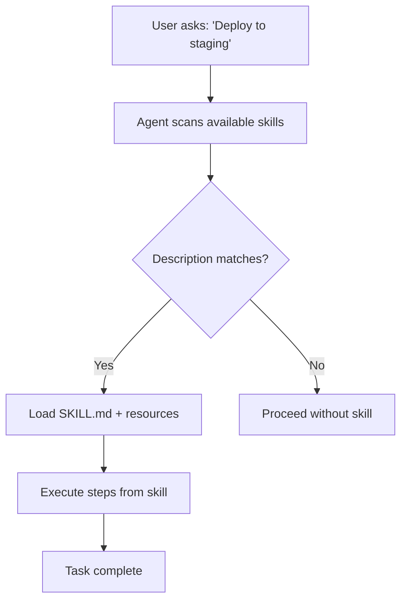

import FileTree from '@site/src/components/copilot/FileTree';
import ConfigBuilder from '@site/src/components/copilot/ConfigBuilder';
import Quiz from '@site/src/components/copilot/Quiz';

# Agent Skills

Agent Skills are **multi-step workflow definitions** with bundled resources. Unlike prompt files (which you invoke manually), skills **auto-load** when the agent determines a task matches the skill's description.

## The Open Standard

Agent Skills follow an open standard defined at [agentskills.io](https://agentskills.io). The format is simple: a `SKILL.md` file that describes what the skill does and how to execute it.

## Structure

```
.github/skills/
  deploy/
    SKILL.md          # Skill definition
    scripts/
      deploy.sh       # Bundled scripts
      validate.sh
    references/
      architecture.md # Context documents
```

<FileTree
  files={[
    { name: '.github', type: 'dir', children: [
      { name: 'skills', type: 'dir', children: [
        { name: 'deploy', type: 'dir', children: [
          { name: 'SKILL.md', type: 'file' },
          { name: 'scripts', type: 'dir', children: [
            { name: 'deploy.sh', type: 'file' },
            { name: 'validate.sh', type: 'file' },
          ]},
          { name: 'references', type: 'dir', children: [
            { name: 'architecture.md', type: 'file' },
          ]},
        ]},
        { name: 'database-migration', type: 'dir', children: [
          { name: 'SKILL.md', type: 'file' },
          { name: 'scripts', type: 'dir', children: [
            { name: 'migrate.sh', type: 'file' },
          ]},
        ]},
      ]},
    ]},
  ]}
  highlight={['SKILL.md']}
/>

## SKILL.md Format

```markdown title=".github/skills/deploy/SKILL.md"
---
description: "Deploy the application to production or staging environments"
---

# Deploy Skill

## Prerequisites
- AWS CLI configured with appropriate credentials
- Docker installed and running

## Steps

1. Run validation: `./scripts/validate.sh`
2. Build the Docker image: `docker build -t app:latest .`
3. Push to ECR: `./scripts/deploy.sh $ENVIRONMENT`
4. Verify health check passes
5. Report deployment status

## Environment Variables
- `ENVIRONMENT` — target environment (staging, production)
- `AWS_REGION` — AWS region (default: us-east-1)

## Rollback
If deployment fails, run: `./scripts/deploy.sh rollback`
```

The `description` field is critical — it's what the agent uses to decide whether this skill matches the current task.

## Project vs Personal Skills

### Project Skills
Live in the repo at `.github/skills/`. Available to anyone working in that repo.

### Personal Skills
Stored in your personal dotfiles or a local directory. Follow you across repos.

Configure the path in VS Code settings:
```json
{
  "github.copilot.chat.agent.skills.dirs": [
    "~/.copilot-skills"
  ]
}
```

## How Auto-Loading Works



The agent reads each skill's `description` and decides if it's relevant. You don't need to explicitly invoke skills — they activate automatically.

## Real-World Example: PR Review Skill

```markdown title=".github/skills/pr-review/SKILL.md"
---
description: "Comprehensive pull request code review with security, performance, and style checks"
---

# PR Review Skill

## Process

1. **Fetch the diff** — Get all changed files in the PR
2. **Security scan** — Check for:
   - Hardcoded credentials or API keys
   - SQL injection patterns
   - XSS vulnerabilities
   - Insecure deserialization
3. **Performance review** — Look for:
   - N+1 query patterns
   - Missing database indexes
   - Unnecessary re-renders in React
   - Large bundle imports
4. **Style check** — Verify:
   - Consistent naming conventions
   - Proper error handling
   - Test coverage for new code
5. **Generate report** — Summarize findings with severity levels

## Output Format
Use GitHub PR review comments, not a single mega-comment.
Inline comments on specific lines when possible.
```

## Try It

<ConfigBuilder type="skill" />

## Knowledge Check

<Quiz questions={[
  {
    question: "How does the agent decide which skill to use?",
    options: ["User invokes it by name", "Matches the description field", "Alphabetical order", "Most recently modified"],
    correct: 1,
    explanation: "The agent reads each skill's description field and automatically selects skills whose description matches the current task."
  },
  {
    question: "What's the standard filename for a skill definition?",
    options: ["skill.json", "SKILL.md", "index.skill.md", ".skill"],
    correct: 1,
    explanation: "The standard filename is SKILL.md (uppercase), following the AgentSkills open standard at agentskills.io."
  }
]} />
