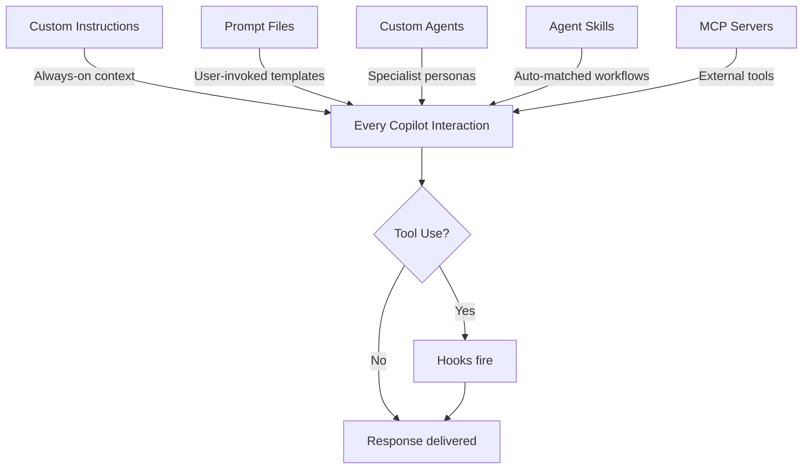
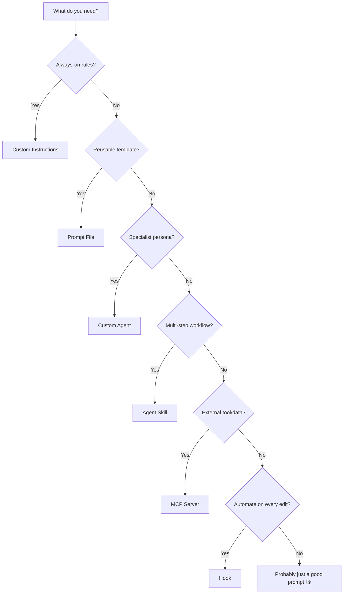

import FileTree from '@site/src/components/copilot/FileTree';
import Quiz from '@site/src/components/copilot/Quiz';

# Putting It All Together

Each customization feature is powerful on its own. Combined, they create an AI coding environment that truly understands your project, enforces your standards, and has access to your tools.

## How Features Layer

## Decision Flowchart

Not sure which feature to use? Follow this:

## Real-World Project Setup

Here's a complete setup for a Next.js SaaS application:

<FileTree
  files={[
    { name: '.github', type: 'dir', children: [
      { name: 'copilot-instructions.md', type: 'file' },
      { name: 'instructions', type: 'dir', children: [
        { name: 'frontend.instructions.md', type: 'file' },
        { name: 'api.instructions.md', type: 'file' },
        { name: 'database.instructions.md', type: 'file' },
        { name: 'tests.instructions.md', type: 'file' },
      ]},
      { name: 'prompts', type: 'dir', children: [
        { name: 'new-feature.prompt.md', type: 'file' },
        { name: 'write-tests.prompt.md', type: 'file' },
        { name: 'migration.prompt.md', type: 'file' },
        { name: 'pr-description.prompt.md', type: 'file' },
      ]},
      { name: 'agents', type: 'dir', children: [
        { name: 'security-reviewer.md', type: 'file' },
        { name: 'performance-auditor.md', type: 'file' },
        { name: 'ux-reviewer.md', type: 'file' },
      ]},
      { name: 'skills', type: 'dir', children: [
        { name: 'deploy', type: 'dir', children: [
          { name: 'SKILL.md', type: 'file' },
          { name: 'scripts', type: 'dir', children: [
            { name: 'deploy.sh', type: 'file' },
          ]},
        ]},
        { name: 'onboarding', type: 'dir', children: [
          { name: 'SKILL.md', type: 'file' },
        ]},
      ]},
      { name: 'hooks', type: 'dir', children: [
        { name: 'format.json', type: 'file' },
        { name: 'security-scan.json', type: 'file' },
      ]},
    ]},
    { name: '.vscode', type: 'dir', children: [
      { name: 'mcp.json', type: 'file' },
    ]},
  ]}
  highlight={['copilot-instructions.md', 'format.json', 'mcp.json']}
/>

### What Each Piece Does

| Layer | File | Purpose |
|---|---|---|
| **Foundation** | `copilot-instructions.md` | TypeScript strict, Next.js conventions, naming standards |
| **Targeted rules** | `instructions/*.instructions.md` | Path-specific: React patterns for components, Zod for APIs |
| **Templates** | `prompts/*.prompt.md` | Scaffold features, write tests, generate migrations |
| **Experts** | `agents/*.md` | Security, performance, and UX review specialists |
| **Workflows** | `skills/*/SKILL.md` | Multi-step deploy and onboarding processes |
| **Quality gates** | `hooks/*.json` | Auto-format, security scan on every edit |
| **External tools** | `mcp.json` | Database queries, GitHub API, browser testing |

## Best Practices

### 1. Start Small
Don't add all 7 features at once. Start with Custom Instructions, then add features as needs arise.

### 2. Layer, Don't Duplicate
Instructions set the baseline. Prompt files handle specific tasks. Agents are specialists. Don't repeat the same rules in all three places.

### 3. Version Control Everything
All these files live in `.github/` — they're version-controlled, code-reviewed, and shared with the team. Treat them like code.

### 4. Review Periodically
Schedule quarterly reviews of your Copilot customizations. Remove outdated instructions. Update examples. Add new prompt files for emerging patterns.

### 5. Use Hooks for Non-Negotiables
If something must happen every time (formatting, linting, security scans), make it a hook. Don't rely on instructions — the AI might skip them.

### 6. Keep Descriptions Clear
Agent descriptions and skill descriptions determine auto-matching. Vague descriptions = poor matching. Be specific about when each should activate.

## Final Quiz

<Quiz questions={[
  {
    question: "Which feature should you use for rules that must run every single time, without exception?",
    options: ["Custom Instructions", "Hooks", "Custom Agents", "Prompt Files"],
    correct: 1,
    explanation: "Hooks execute deterministically at lifecycle points. Instructions are guidance the AI follows, but hooks are mechanical — they always run."
  },
  {
    question: "A teammate asks you to set up Copilot to scaffold a new API endpoint with tests. Which feature?",
    options: ["Custom Instructions", "Prompt File", "Hook", "MCP Server"],
    correct: 1,
    explanation: "A prompt file is perfect for reusable task templates like scaffolding. You define the steps once, and anyone on the team can invoke it."
  },
  {
    question: "You need Copilot to query your company's internal knowledge base. Which feature?",
    options: ["Custom Instructions", "Custom Agent", "MCP Server", "Agent Skill"],
    correct: 2,
    explanation: "MCP Servers connect Copilot to external data sources and tools. Set up an MCP server that talks to your knowledge base API."
  },
  {
    question: "What's the recommended order to adopt Copilot customization features?",
    options: ["All at once for maximum benefit", "Hooks first, then everything else", "Instructions → Prompts → Agents → Skills → Hooks → MCP", "MCP first since it's most powerful"],
    correct: 2,
    explanation: "Start with Custom Instructions (foundation), add Prompt Files for common tasks, then layer on Agents, Skills, Hooks, and MCP as needs grow."
  }
]} />

---

🎉 **You've completed the Copilot Customization guide!** Check out the [GitHub Copilot docs](https://docs.github.com/en/copilot) for the latest updates.
